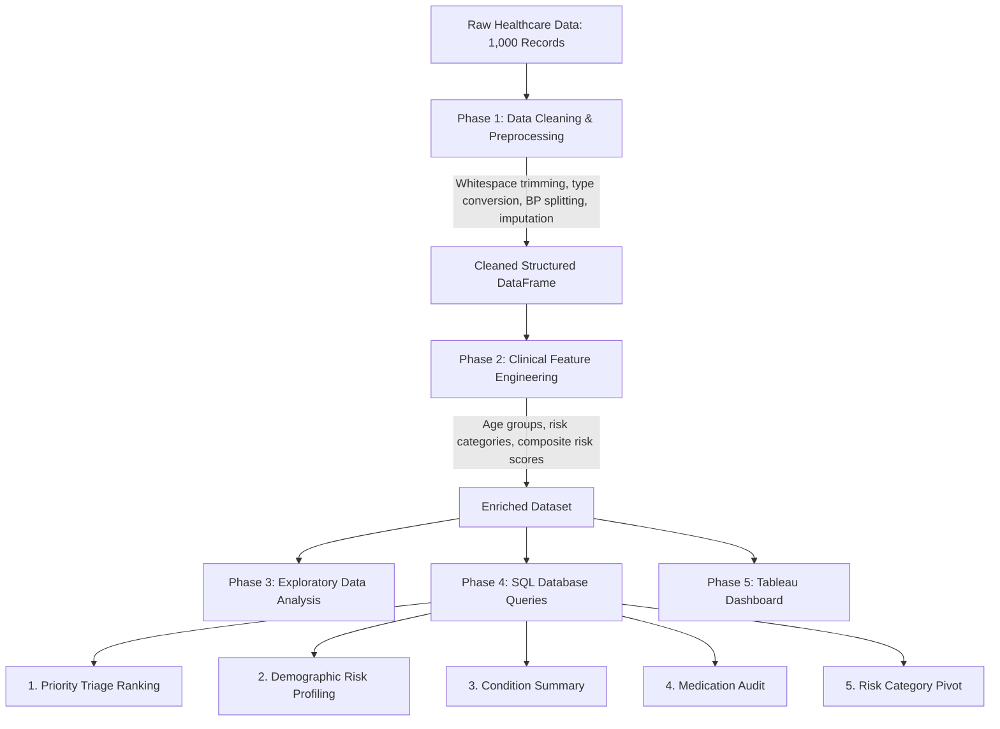
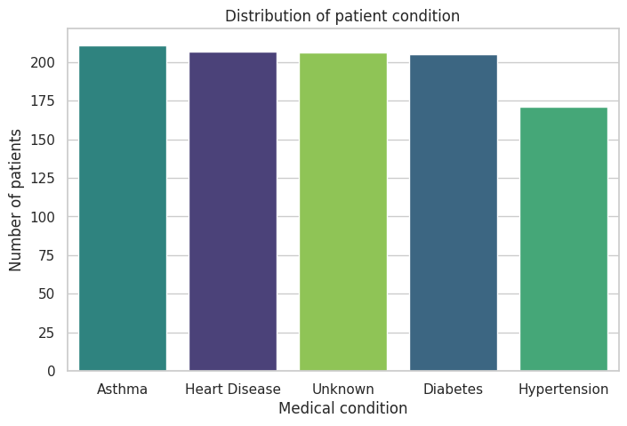
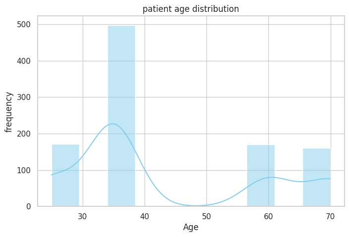
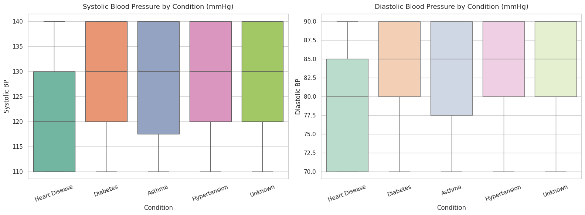
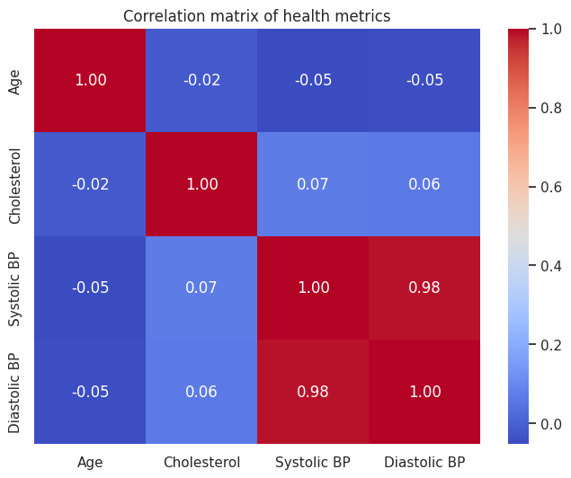
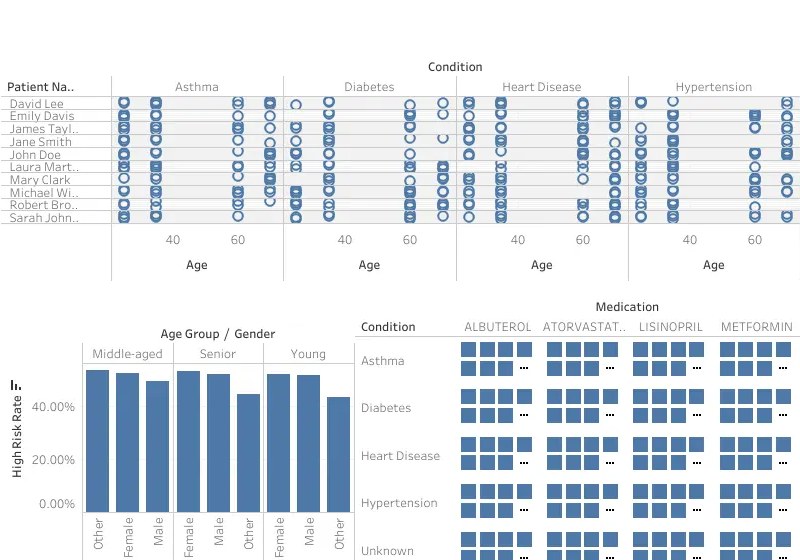

# Healthcare Patient Analytics: Data Cleaning, EDA & SQL Pipeline

An end-to-end data analytics project focused on cleaning inconsistent electronic health records, engineering clinical risk features, exploring biometric distributions, and running SQL queries for patient triage and operational reporting.

[Open Interactive Notebook in Google Colab](https://colab.research.google.com/drive/1Ai9yKhi_wmPtIy6m0Ur9T7IhHtjBKNO2?usp=sharing)

---

## Project Overview

Electronic health record (EHR) systems often collect clinical and patient data across different formats, resulting in data quality issues such as inconsistent text formatting, mixed date representations, composite strings for vital signs, and missing values.

This project walks through a practical workflow to turn 1,000 raw patient records into clean, reliable data ready for analysis:
1. **Data Cleaning and Preprocessing (Python / Pandas)**: Cleaned string fields, standardized dates into ISO format, parsed composite blood pressure strings into separate systolic and diastolic fields, and handled missing values using appropriate imputation strategies.
2. **Clinical Feature Engineering**: Created demographic age buckets, categorized high-risk cardiovascular patients, and built a composite 0–3 clinical risk score.
3. **Exploratory Data Analysis (EDA)**: Analyzed disease prevalence, patient age demographics, and vital sign relationships using visual distributions and correlation heatmaps.
4. **Relational Database Analytics (SQL)**: Structured a series of SQL queries to generate patient priority triage lists, summarize condition statistics, evaluate medication adherence, and create demographic cross-tabulations.
5. **Business Intelligence (Tableau)**: Outlined an interactive dashboard framework to track key metrics and support clinical resource planning.

---

## Repository Structure

```text
Healthcare-Practice/
├── data/
│   ├── raw/
│   │   └── Healthcare_Messy_Data.csv      # Raw dataset with formatting and data quality issues
│   └── processed/
│       ├── Healthcare_Cleaned_Data.csv    # Cleaned dataset (CSV)
│       └── Healthcare_Cleaned_Data.xlsx   # Cleaned dataset (Excel)
├── notebooks/
│   └── Healthcare_Data.ipynb             # Jupyter Notebook covering cleaning, EDA, and feature engineering
├── sql/
│   ├── 01_patient_triage_ranking.sql          # Window-ranked priority queue for high-risk patients
│   ├── 02_demographic_gender_risk_profiling.sql # Risk rates and average vitals across demographics
│   ├── 03_clinical_summary_by_condition.sql     # Patient volume, cholesterol, and risk by condition
│   ├── 04_medication_audit_untreated_rate.sql   # Medication distribution and untreated patient rates
│   └── 05_risk_category_age_pivot.sql          # Risk category counts pivoted by age group
├── assets/
│   └── .gitkeep                          # Directory for charts, plots, and dashboard screenshots
├── .gitignore                            # Standard git exclusions
├── requirements.txt                      # Project dependencies
└── README.md                             # Project documentation
```

---

## Pipeline Flow



---

## Phase 1: Data Cleaning & Preprocessing

The initial dataset contained 1,000 rows and 10 columns with several data quality issues:

| Field | Issue in Raw Data | Cleaning Applied |
| :--- | :--- | :--- |
| **Patient Name** | Irregular casing and extra whitespace | Stripped leading/trailing whitespace and applied title casing |
| **Age** | Text words (e.g., `'forty'`) and 159 missing values | Converted string numbers to numeric, filled missing values with the median age (35), and cast to integer |
| **Visit Date** | Inconsistent formats (`'01/15/2020'`, `'April 5, 2018'`, `'2019.12.01'`) | Parsed and standardized into `YYYY-MM-DD` date format |
| **Blood Pressure** | Combined string format (`'140/90'`) | Split on `/` into separate numeric `Systolic_BP` and `Diastolic_BP` columns |
| **Cholesterol** | 231 missing values | Imputed missing values using the median value (180.0 mg/dL) |
| **Condition** | 206 missing entries | Replaced missing values with `'Unknown'` to keep categories distinct |
| **Medication** | Inconsistent whitespace | Stripped whitespace and standardized uppercase strings |
| **Email & Phone Number** | Blank spaces and string `'nan'` entries | Standardized empty entries to null values (`NaN`) |
| **Duplicate Rows** | Repeated entries | Removed duplicate records using `drop_duplicates(keep='first')` |


---

## Phase 2: Feature Engineering

To support deeper analysis and operational triage, three clinical features were created:

### 1. Age Groups (`Age_Group`)
Patients were binned into three standard demographic groups:
* **Young**: 0–29 years old
* **Middle-aged**: 30–55 years old
* **Senior**: 56–100 years old

### 2. Risk Category (`Risk_Category`)
Patients were marked as **High Risk** if they met either threshold for stage 2 hypertension or high cholesterol:
* `Systolic_BP >= 140 mmHg` OR `Cholesterol >= 200 mg/dL`
* All other patients were categorized as **Low Risk**.

### 3. Composite Risk Score (`Risk_Score`: 0 to 3)
A simple additive risk index to evaluate overall cardiovascular risk:
* **+1 point**: Systolic BP >= 130 mmHg (elevated or stage 1 hypertension)
* **+1 point**: Cholesterol >= 200 mg/dL (borderline high or high)
* **+1 point**: Diagnosed with a chronic or severe condition (`Heart Disease`, `Hypertension`, `Diabetes`, `Asthma`, or `Cancer`)

```python
# Risk score computation
df['Risk_Score'] = 0
df.loc[df['Systolic BP'] >= 130, 'Risk_Score'] += 1
df.loc[df['Cholesterol'] >= 200, 'Risk_Score'] += 1

severe_conditions = ['Heart Disease', 'Hypertension', 'Diabetes', 'Asthma', 'Cancer']
df.loc[df['Condition'].isin(severe_conditions), 'Risk_Score'] += 1
```

---

## Phase 3: Exploratory Data Analysis & Key Findings

### 1. Statistical Summary of Numeric Health Metrics

Descriptive statistics across the core biometric variables (`Age`, `Cholesterol`, `Systolic BP`, and `Diastolic BP`):

```text
               Age  Cholesterol  Systolic BP  Diastolic BP
count  1000.000000  1000.000000   834.000000    834.000000
mean     43.175000   187.100000   125.371703     81.420863
std      15.937326    19.919508    11.467097      7.554625
min      25.000000   160.000000   110.000000     70.000000
25%      35.000000   180.000000   110.000000     70.000000
50%      35.000000   180.000000   130.000000     85.000000
75%      60.000000   200.000000   140.000000     90.000000
max      70.000000   220.000000   140.000000     90.000000
```

| Metric | Age (Years) | Cholesterol (mg/dL) | Systolic BP (mmHg) | Diastolic BP (mmHg) |
| :--- | :--- | :--- | :--- | :--- |
| **Count** | 1,000.00 | 1,000.00 | 834.00 | 834.00 |
| **Mean** | 43.18 | 187.10 | 125.37 | 81.42 |
| **Std Dev** | 15.94 | 19.92 | 11.47 | 7.55 |
| **Min** | 25.00 | 160.00 | 110.00 | 70.00 |
| **25% (Q1)** | 35.00 | 180.00 | 110.00 | 70.00 |
| **50% (Median)** | 35.00 | 180.00 | 130.00 | 85.00 |
| **75% (Q3)** | 60.00 | 200.00 | 140.00 | 90.00 |
| **Max** | 70.00 | 220.00 | 140.00 | 90.00 |

#### Key Analytical & Clinical Takeaways:

1. **Data Completeness & Imputation Dynamics (`count`)**:
   * **Age & Cholesterol (1,000 records)**: 100% complete after cleaning and median imputation (159 missing age values and 231 missing cholesterol values imputed).
   * **Blood Pressure (834 records)**: 166 records in the raw dataset had missing or unparseable blood pressure entries, leaving 834 valid paired systolic/diastolic measurements.

2. **Patient Age Distribution (`Age`)**:
   * **Central Tendency & Spread**: Mean age is **43.18 years** ($\pm 15.94$), spanning from **25.0 to 70.0 years**.
   * **Imputation Clustering**: Both Q1 (25%) and Median (50%) are **35.0 years** because 159 missing values were imputed using the median (35), creating a noticeable spike at age 35. The upper quartile ($75\% = 60.0$ years) and maximum (70.0 years) reflect a substantial senior cohort.

3. **Lipid Profile (`Cholesterol`)**:
   * **Central Tendency**: Mean is **187.10 mg/dL** with a median of **180.00 mg/dL** ($\text{IQR} = 180.0 - 200.0\text{ mg/dL}$).
   * **Cardiovascular Risk Threshold**: At least 75% of patients maintain cholesterol levels at or below the standard normal threshold ($200\text{ mg/dL}$). However, the upper quartile ($75\%\text{ to Max} = 200.0 - 220.0\text{ mg/dL}$) crosses into the borderline-high / hypercholesterolemia clinical risk range.

4. **Hemodynamic Profile (`Systolic BP` & `Diastolic BP`)**:
   * **Systolic Blood Pressure**: Average of **125.37 mmHg** with a median of **130.00 mmHg** (range: 110.0–140.0 mmHg). Over 50% of patients with recorded BP exhibit elevated or Stage 1 hypertension levels ($\ge 130\text{ mmHg}$), with the top 25% reaching the **140.0 mmHg** threshold (Stage 2 Hypertension criteria).
   * **Diastolic Blood Pressure**: Average of **81.42 mmHg** with a median of **85.00 mmHg** (range: 70.0–90.0 mmHg). The median (85.0 mmHg) and upper quartile (90.0 mmHg) indicate widespread Stage 1 and Stage 2 diastolic elevation across the patient population.

---

### 2. Condition Breakdown
Examining diagnosis counts showed how patients were distributed across major conditions:


*Figure 1: Distribution of patient records by medical condition.*

* **Insight**: Diagnosed conditions are distributed across Asthma (~210), Heart Disease (~207), Diabetes (~205), and Hypertension (~171), with ~206 records classified as Unknown.

---

### 3. Age Demographics
Visualizing patient age helped identify the predominant age groups in the clinic population:


*Figure 2: Histogram and density curve of patient ages.*

* **Insight**: The distribution shows a pronounced density spike at age 35 due to median imputation, alongside distinct demographic clusters among young adults (25–30) and older adults (57–70).

---

### 4. Blood Pressure by Medical Condition
Boxplots were used to examine systolic and diastolic blood pressure ranges across diagnostic groups:


*Figure 3: Systolic and diastolic blood pressure distributions across conditions.*

* **Insight**: Patients across Diabetes, Asthma, and Hypertension exhibit elevated median systolic (130 mmHg) and diastolic (85 mmHg) levels, with upper quartiles consistently reaching 140/90 mmHg.

---

### 5. Correlation Between Health Metrics
A heatmap was generated to inspect relationships among continuous numeric metrics:


*Figure 4: Correlation heatmap of numeric health metrics.*

* **Insight**: Systolic and diastolic blood pressure exhibit a near-perfect positive linear correlation ($r = 0.98$). In contrast, age and cholesterol display near-zero correlation with blood pressure in this cohort ($r \approx -0.05\text{ to }0.07$), indicating that cardiovascular risk factors are distributed across different demographic segments.

---

## Phase 4: Relational Database Analytics & SQL Results

The cleaned data was loaded into a relational database table (`Healthcare_SQL.healthcare_cleaned_data`) to execute analytical reporting and clinical triage queries:

### 1. High-Risk Patient Triage Ranking (`01_patient_triage_ranking.sql`)
Ranks high-risk patients using window functions (`DENSE_RANK()`) across risk score, systolic blood pressure, and cholesterol to prioritize outreach:

```sql
SELECT 
    `Patient Name`,
    `Age`,
    `Gender`,
    `Condition`,
    `Systolic BP`,
    `Cholesterol`,
    `Risk_Score`,
    `Phone Number`,
    `Email`,
    DENSE_RANK() OVER (
        ORDER BY `Risk_Score` DESC, `Systolic BP` DESC, `Cholesterol` DESC
    ) AS Triage_Priority_Rank
FROM `Healthcare_SQL`.`healthcare_cleaned_data`
WHERE `Risk_Category` = 'High Risk'
ORDER BY Triage_Priority_Rank ASC;
```

#### Query Output *(First 5 Distinct Priority Ranks)*:

| Patient Name | Age | Gender | Condition | Systolic BP (mmHg) | Cholesterol (mg/dL) | Risk Score | Phone Number | Email | Triage Priority Rank |
| :--- | :--- | :--- | :--- | :--- | :--- | :--- | :--- | :--- | :--- |
| Robert Brown | 70 | Male | Asthma | 140 | 220 | 3 | 098-765-4321 | contact@domain.com | **1** |
| David Lee | 25 | Other | Heart Disease | 140 | 200 | 3 | 555-555-5555 | name@hospital.org | **2** |
| Sarah Johnson | 70 | Female | Hypertension | 130 | 220 | 3 | *(null)* | *(null)* | **3** |
| Jane Smith | 35 | Male | Asthma | 130 | 200 | 3 | 123-456-7890 | *(null)* | **4** |
| Michael Wilson | 35 | Female | Unknown | 140 | 220 | 2 | 555-555-5555 | patient@example.com | **5** |

* **Insight**: Window ranking segments patients into prioritized tiers based on composite clinical risk, allowing care teams to intervene immediately with Tier 1 and Tier 2 patients.

---

### 2. Demographic & Gender Risk Profiling (`02_demographic_gender_risk_profiling.sql`)
Calculates the proportion of high-risk patients along with average vital signs for each demographic cohort:

```sql
SELECT 
    `Gender`,
    `Age_Group`,
    COUNT(*) AS Total_Patients,
    SUM(CASE WHEN `Risk_Category` = 'High Risk' THEN 1 ELSE 0 END) AS High_Risk_Patients,
    ROUND(100.0 * SUM(CASE WHEN `Risk_Category` = 'High Risk' THEN 1 ELSE 0 END) / COUNT(*), 2) AS High_Risk_Rate_Pct,
    ROUND(AVG(`Systolic BP`), 1) AS Avg_Systolic_BP,
    ROUND(AVG(`Cholesterol`), 1) AS Avg_Cholesterol
FROM `Healthcare_SQL`.`healthcare_cleaned_data`
GROUP BY `Gender`, `Age_Group`
ORDER BY `Age_Group`, High_Risk_Rate_Pct DESC;
```

#### Query Output *(Top 5 Demographic Cohorts by Volume & Risk)*:

| Gender | Age Group | Total Patients | High-Risk Patients | High-Risk Rate (%) | Avg Systolic BP (mmHg) | Avg Cholesterol (mg/dL) |
| :--- | :--- | :--- | :--- | :--- | :--- | :--- |
| Other | Middle-aged | 121 | 68 | 56.20% | 126.3 | 188.3 |
| Female | Middle-aged | 153 | 84 | 54.90% | 125.6 | 188.4 |
| Male | Middle-aged | 148 | 80 | 54.05% | 125.9 | 185.9 |
| Female | Senior | 94 | 54 | 57.45% | 124.3 | 190.0 |
| Male | Senior | 87 | 49 | 56.32% | 125.1 | 188.5 |

* **Insight**: High-risk prevalence remains above 54% across middle-aged and senior groups regardless of gender, confirming that age is the primary contributor to cardiovascular vulnerability.

---

### 3. Clinical Summary by Medical Condition (`03_clinical_summary_by_condition.sql`)
Summarizes patient counts, average cholesterol levels, and average risk scores grouped by diagnosis:

```sql
SELECT 
    `Condition`,
    COUNT(*) AS Patient_Count,
    ROUND(AVG(`Cholesterol`), 2) AS Avg_Cholesterol,
    ROUND(AVG(`Risk_Score`), 2) AS Avg_Risk_Score
FROM `Healthcare_SQL`.`healthcare_cleaned_data`
GROUP BY `Condition`
ORDER BY Avg_Risk_Score DESC;
```

#### Query Output:

| Condition | Patient Count | Avg Cholesterol (mg/dL) | Avg Risk Score |
| :--- | :--- | :--- | :--- |
| **Asthma** | 176 | 188.86 | 1.94 |
| **Diabetes** | 176 | 188.75 | 1.90 |
| **Hypertension** | 139 | 186.62 | 1.88 |
| **Heart Disease** | 173 | 186.36 | 1.86 |
| **Unknown** | 170 | 186.24 | 0.86 |

* **Insight**: Diagnosed conditions present elevated average risk scores (1.86–1.94) and higher average cholesterol compared to unassigned records (`Unknown` with 0.86).

---

### 4. Medication Audit & Untreated Rate (`04_medication_audit_untreated_rate.sql`)
Examines the distribution of medications for each condition to identify patients who are not currently receiving treatment:

```sql
SELECT 
    `Condition`,
    `Medication`,
    COUNT(*) AS Patient_Count,
    ROUND(100.0 * COUNT(*) / SUM(COUNT(*)) OVER (PARTITION BY `Condition`), 2) AS Pct_Within_Condition,
    ROUND(AVG(`Risk_Score`), 2) AS Avg_Risk_Score
FROM `Healthcare_SQL`.`healthcare_cleaned_data`
GROUP BY `Condition`, `Medication`
ORDER BY `Condition`, Patient_Count DESC;
```

#### Query Output *(Top 2 Medications per Condition)*:

| Condition | Medication | Patient Count | % Within Condition | Avg Risk Score |
| :--- | :--- | :--- | :--- | :--- |
| **Asthma** | ATORVASTATIN | 46 | 26.14% | 1.78 |
| **Asthma** | ALBUTEROL | 34 | 19.32% | 2.00 |
| **Diabetes** | METFORMIN | 40 | 22.73% | 1.88 |
| **Diabetes** | LISINOPRIL | 38 | 21.59% | 1.84 |
| **Heart Disease** | ATORVASTATIN | 46 | 26.59% | 1.91 |
| **Heart Disease** | METFORMIN | 39 | 22.54% | 1.72 |
| **Hypertension** | ATORVASTATIN | 31 | 22.30% | 1.77 |
| **Hypertension** | NONE *(Untreated)* | 29 | 20.86% | 1.79 |
| **Unknown** | NONE | 42 | 24.71% | 0.64 |
| **Unknown** | ALBUTEROL | 40 | 23.53% | 0.93 |

* **Insight**: In Hypertension, 20.86% of patients (29 individuals) are currently unmedicated (`NONE`), identifying a crucial gap in care management.

---

### 5. Risk Category & Age Group Pivot (`05_risk_category_age_pivot.sql`)
Produces a cross-tabulation table summarizing patient counts across risk levels and age categories:

```sql
SELECT 
    Risk_Category,
    COUNT(CASE WHEN Age_Group = 'Young Adult' THEN 1 END) AS Young_Adult,
    COUNT(CASE WHEN Age_Group = 'Middle-Aged' THEN 1 END) AS Middle_Aged,
    COUNT(CASE WHEN Age_Group = 'Senior' THEN 1 END) AS Senior,
    COUNT(*) AS Total_Patients
FROM `Healthcare_SQL`.`healthcare_cleaned_data`
GROUP BY Risk_Category;
```

#### Query Output:

| Risk Category | Young Adult | Middle-Aged | Senior | Total Patients |
| :--- | :--- | :--- | :--- | :--- |
| **High Risk** | 0 | 232 | 145 | 446 |
| **Low Risk** | 0 | 190 | 125 | 388 |

* **Insight**: Out of 834 evaluated patients with blood pressure records, 446 patients (53.48%) fall into the **High Risk** category, with 232 concentrated in the middle-aged cohort and 145 in seniors.

---

## Phase 5: Tableau Dashboard

An executive dashboard was designed in Tableau (`Healthcare Tablue.twb`) to give healthcare staff and leadership a visual summary of clinic performance:

<!-- Placeholder for Tableau Dashboard Screenshot -->

*Figure 5: Preview of the interactive Tableau clinical dashboard.*

### Main Dashboard Elements:
* **KPI Metrics**: Total patient count, percentage of high-risk patients, average risk score, and patients requiring immediate triage.
* **Demographic Breakdown**: Distribution of high-risk patients filtered by gender and age group.
* **Vitals Scatter Plot**: Visual comparison of systolic blood pressure versus cholesterol levels against clinical threshold lines.
* **Untreated Patient Tracker**: Table listing high-risk patients with no active medication for prompt follow-up.

---

## Author & Contact

* **Author**: [Abdullah Bin Madhi](https://github.com/abdullah-binmadhi)
* **Interactive Notebook**: [Google Colab Link](https://colab.research.google.com/drive/1Ai9yKhi_wmPtIy6m0Ur9T7IhHtjBKNO2?usp=sharing)
