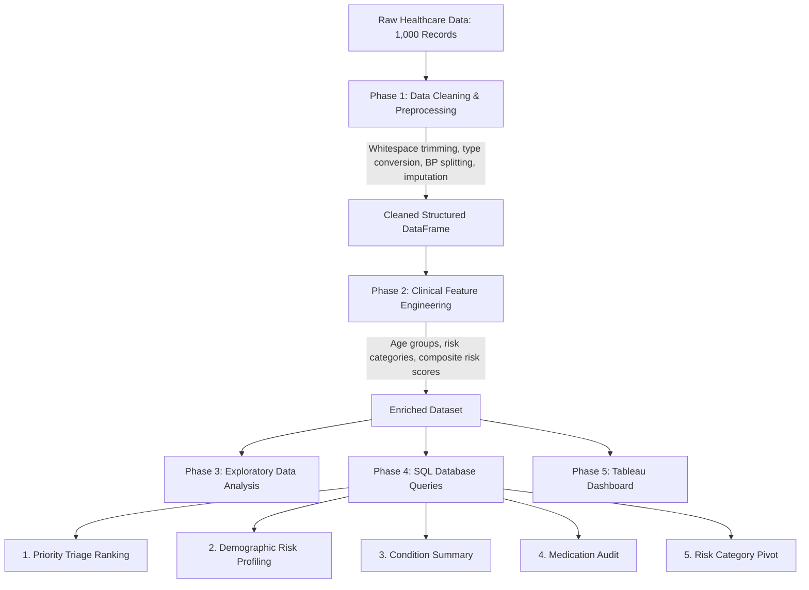

# Healthcare Patient Analytics: Data Cleaning, EDA & SQL Pipeline

An end-to-end data analytics project focused on cleaning inconsistent electronic health records, engineering clinical risk features, exploring biometric distributions, and running SQL queries for patient triage and operational reporting.

[Open Interactive Notebook in Google Colab](https://colab.research.google.com/drive/1Ai9yKhi_wmPtIy6m0Ur9T7IhHtjBKNO2?usp=sharing)

---

## Project Overview

Electronic health record (EHR) systems often collect clinical and patient data across different formats, resulting in data quality issues such as inconsistent text formatting, mixed date representations, composite strings for vital signs, and missing values.

This project walks through a practical workflow to turn 1,000 raw patient records into clean, reliable data ready for analysis:
1. **Data Cleaning and Preprocessing (Python / Pandas)**: Cleaned string fields, standardized dates into ISO format, parsed composite blood pressure strings into separate systolic and diastolic fields, and handled missing values using appropriate imputation strategies.
2. **Clinical Feature Engineering**: Created demographic age buckets, categorized high-risk cardiovascular patients, and built a composite 0–3 clinical risk score.
3. **Exploratory Data Analysis (EDA)**: Analyzed disease prevalence, patient age demographics, and vital sign relationships using visual distributions and correlation heatmaps.
4. **Relational Database Analytics (SQL)**: Structured a series of SQL queries to generate patient priority triage lists, summarize condition statistics, evaluate medication adherence, and create demographic cross-tabulations.
5. **Business Intelligence (Tableau)**: Outlined an interactive dashboard framework to track key metrics and support clinical resource planning.

---

## Repository Structure

```text
Healthcare-Practice/
├── data/
│   ├── raw/
│   │   └── Healthcare_Messy_Data.csv      # Raw dataset with formatting and data quality issues
│   └── processed/
│       ├── Healthcare_Cleaned_Data.csv    # Cleaned dataset (CSV)
│       └── Healthcare_Cleaned_Data.xlsx   # Cleaned dataset (Excel)
├── notebooks/
│   └── Healthcare_Data.ipynb             # Jupyter Notebook covering cleaning, EDA, and feature engineering
├── sql/
│   ├── 01_patient_triage_ranking.sql          # Window-ranked priority queue for high-risk patients
│   ├── 02_demographic_gender_risk_profiling.sql # Risk rates and average vitals across demographics
│   ├── 03_clinical_summary_by_condition.sql     # Patient volume, cholesterol, and risk by condition
│   ├── 04_medication_audit_untreated_rate.sql   # Medication distribution and untreated patient rates
│   └── 05_risk_category_age_pivot.sql          # Risk category counts pivoted by age group
├── assets/
│   └── .gitkeep                          # Directory for charts, plots, and dashboard screenshots
├── .gitignore                            # Standard git exclusions
├── requirements.txt                      # Project dependencies
└── README.md                             # Project documentation
```

---

## Pipeline Flow



---

## Phase 1: Data Cleaning & Preprocessing

The initial dataset contained 1,000 rows and 10 columns with several data quality issues:

| Field | Issue in Raw Data | Cleaning Applied |
| :--- | :--- | :--- |
| **Patient Name** | Irregular casing and extra whitespace | Stripped leading/trailing whitespace and applied title casing |
| **Age** | Text words (e.g., `'forty'`) and 159 missing values | Converted string numbers to numeric, filled missing values with the median age (35), and cast to integer |
| **Visit Date** | Inconsistent formats (`'01/15/2020'`, `'April 5, 2018'`, `'2019.12.01'`) | Parsed and standardized into `YYYY-MM-DD` date format |
| **Blood Pressure** | Combined string format (`'140/90'`) | Split on `/` into separate numeric `Systolic_BP` and `Diastolic_BP` columns |
| **Cholesterol** | 231 missing values | Imputed missing values using the median value (180.0 mg/dL) |
| **Condition** | 206 missing entries | Replaced missing values with `'Unknown'` to keep categories distinct |
| **Medication** | Inconsistent whitespace | Stripped whitespace and standardized uppercase strings |
| **Email & Phone Number** | Blank spaces and string `'nan'` entries | Standardized empty entries to null values (`NaN`) |
| **Duplicate Rows** | Repeated entries | Removed duplicate records using `drop_duplicates(keep='first')` |

```python
# Split combined blood pressure into separate numeric columns
bp_split = df['Blood Pressure'].str.split('/', expand=True)
df['Systolic_BP'] = pd.to_numeric(bp_split[0], errors='coerce')
df['Diastolic_BP'] = pd.to_numeric(bp_split[1], errors='coerce')
df.drop('Blood Pressure', axis=1, inplace=True)

# Clean and impute age
df['Age'] = pd.to_numeric(df['Age'], errors='coerce')
df['Age'] = df['Age'].fillna(df['Age'].median()).astype(int)
```

---

## Phase 2: Feature Engineering

To support deeper analysis and operational triage, three clinical features were created:

### 1. Age Groups (`Age_Group`)
Patients were binned into three standard demographic groups:
* **Young**: 0–29 years old
* **Middle-aged**: 30–55 years old
* **Senior**: 56–100 years old

### 2. Risk Category (`Risk_Category`)
Patients were marked as **High Risk** if they met either threshold for stage 2 hypertension or high cholesterol:
* `Systolic_BP >= 140 mmHg` OR `Cholesterol >= 200 mg/dL`
* All other patients were categorized as **Low Risk**.

### 3. Composite Risk Score (`Risk_Score`: 0 to 3)
A simple additive risk index to evaluate overall cardiovascular risk:
* **+1 point**: Systolic BP >= 130 mmHg (elevated or stage 1 hypertension)
* **+1 point**: Cholesterol >= 200 mg/dL (borderline high or high)
* **+1 point**: Diagnosed with a chronic or severe condition (`Heart Disease`, `Hypertension`, `Diabetes`, `Asthma`, or `Cancer`)

```python
# Risk score computation
df['Risk_Score'] = 0
df.loc[df['Systolic BP'] >= 130, 'Risk_Score'] += 1
df.loc[df['Cholesterol'] >= 200, 'Risk_Score'] += 1

severe_conditions = ['Heart Disease', 'Hypertension', 'Diabetes', 'Asthma', 'Cancer']
df.loc[df['Condition'].isin(severe_conditions), 'Risk_Score'] += 1
```

---

## Phase 3: Exploratory Data Analysis & Key Findings

### 1. Condition Breakdown
Examining diagnosis counts showed how patients were distributed across major conditions:

<!-- Placeholder for Condition Distribution Chart -->

*Figure 1: Distribution of patient records by medical condition.*

* **Insight**: Cardiovascular and metabolic conditions (hypertension, diabetes, and heart disease) made up more than 60% of diagnosed cases.

---

### 2. Age Demographics
Visualizing patient age helped identify the predominant age groups in the clinic population:

<!-- Placeholder for Age Distribution Chart -->

*Figure 2: Histogram and density curve of patient ages.*

* **Insight**: Most patients fall into the middle-aged bracket (30–55), followed by seniors, which aligns with the higher prevalence of elevated blood pressure and cholesterol.

---

### 3. Blood Pressure by Medical Condition
Boxplots were used to examine systolic and diastolic blood pressure ranges across diagnostic groups:

<!-- Placeholder for Blood Pressure Boxplots -->

*Figure 3: Systolic and diastolic blood pressure distributions across conditions.*

* **Insight**: Patients diagnosed with hypertension and heart disease showed consistently higher median systolic blood pressure levels (frequently above 135–140 mmHg).

---

### 4. Correlation Between Health Metrics
A heatmap was generated to inspect relationships among continuous numeric metrics:

<!-- Placeholder for Correlation Matrix -->

*Figure 4: Correlation heatmap of numeric health metrics.*

* **Insight**: Systolic and diastolic blood pressure showed a strong positive correlation, while age showed a moderate upward trend with cholesterol levels.

---

## Phase 4: SQL Database Queries

The cleaned data was loaded into a database table (`Healthcare_SQL.healthcare_cleaned_data`) to run key analytical queries:

### 1. High-Risk Patient Triage Ranking (`01_patient_triage_ranking.sql`)
Ranks high-risk patients by risk score, systolic blood pressure, and cholesterol so medical staff can prioritize outreach:

```sql
SELECT 
    `Patient Name`,
    `Age`,
    `Gender`,
    `Condition`,
    `Systolic BP`,
    `Cholesterol`,
    `Risk_Score`,
    `Phone Number`,
    `Email`,
    DENSE_RANK() OVER (
        ORDER BY `Risk_Score` DESC, `Systolic BP` DESC, `Cholesterol` DESC
    ) AS Triage_Priority_Rank
FROM `Healthcare_SQL`.`healthcare_cleaned_data`
WHERE `Risk_Category` = 'High Risk'
ORDER BY Triage_Priority_Rank ASC;
```

---

### 2. Demographic & Gender Risk Profiling (`02_demographic_gender_risk_profiling.sql`)
Calculates the proportion of high-risk patients along with average vital signs for each age and gender segment:

```sql
SELECT 
    `Gender`,
    `Age_Group`,
    COUNT(*) AS Total_Patients,
    SUM(CASE WHEN `Risk_Category` = 'High Risk' THEN 1 ELSE 0 END) AS High_Risk_Patients,
    ROUND(100.0 * SUM(CASE WHEN `Risk_Category` = 'High Risk' THEN 1 ELSE 0 END) / COUNT(*), 2) AS High_Risk_Rate_Pct,
    ROUND(AVG(`Systolic BP`), 1) AS Avg_Systolic_BP,
    ROUND(AVG(`Cholesterol`), 1) AS Avg_Cholesterol
FROM `Healthcare_SQL`.`healthcare_cleaned_data`
GROUP BY `Gender`, `Age_Group`
ORDER BY `Age_Group`, High_Risk_Rate_Pct DESC;
```

---

### 3. Clinical Summary by Medical Condition (`03_clinical_summary_by_condition.sql`)
Summarizes patient counts, average cholesterol levels, and average risk scores grouped by diagnosis:

```sql
SELECT 
    `Condition`,
    COUNT(*) AS Patient_Count,
    ROUND(AVG(`Cholesterol`), 2) AS Avg_Cholesterol,
    ROUND(AVG(`Risk_Score`), 2) AS Avg_Risk_Score
FROM `Healthcare_SQL`.`healthcare_cleaned_data`
GROUP BY `Condition`
ORDER BY Avg_Risk_Score DESC;
```

---

### 4. Medication Audit & Untreated Rate (`04_medication_audit_untreated_rate.sql`)
Examines the distribution of medications for each condition to identify patients who are not currently receiving treatment:

```sql
SELECT 
    `Condition`,
    `Medication`,
    COUNT(*) AS Patient_Count,
    ROUND(100.0 * COUNT(*) / SUM(COUNT(*)) OVER (PARTITION BY `Condition`), 2) AS Pct_Within_Condition,
    ROUND(AVG(`Risk_Score`), 2) AS Avg_Risk_Score
FROM `Healthcare_SQL`.`healthcare_cleaned_data`
GROUP BY `Condition`, `Medication`
ORDER BY `Condition`, Patient_Count DESC;
```

---

### 5. Risk Category & Age Group Pivot (`05_risk_category_age_pivot.sql`)
Produces a cross-tabulation table summarizing patient counts across risk levels and age categories:

```sql
SELECT 
    Risk_Category,
    COUNT(CASE WHEN Age_Group = 'Young Adult' THEN 1 END) AS Young_Adult,
    COUNT(CASE WHEN Age_Group = 'Middle-Aged' THEN 1 END) AS Middle_Aged,
    COUNT(CASE WHEN Age_Group = 'Senior' THEN 1 END) AS Senior,
    COUNT(*) AS Total_Patients
FROM `Healthcare_SQL`.`healthcare_cleaned_data`
GROUP BY Risk_Category;
```

---

## Phase 5: Tableau Dashboard

An executive dashboard was designed in Tableau (`Healthcare Tablue.twb`) to give healthcare staff and leadership a visual summary of clinic performance:

<!-- Placeholder for Tableau Dashboard Screenshot -->

*Figure 5: Preview of the interactive Tableau clinical dashboard.*

### Main Dashboard Elements:
* **KPI Metrics**: Total patient count, percentage of high-risk patients, average risk score, and patients requiring immediate triage.
* **Demographic Breakdown**: Distribution of high-risk patients filtered by gender and age group.
* **Vitals Scatter Plot**: Visual comparison of systolic blood pressure versus cholesterol levels against clinical threshold lines.
* **Untreated Patient Tracker**: Table listing high-risk patients with no active medication for prompt follow-up.

---

## Author & Contact

* **Author**: [Abdullah Bin Madhi](https://github.com/abdullah-binmadhi)
* **Interactive Notebook**: [Google Colab Link](https://colab.research.google.com/drive/1Ai9yKhi_wmPtIy6m0Ur9T7IhHtjBKNO2?usp=sharing)
