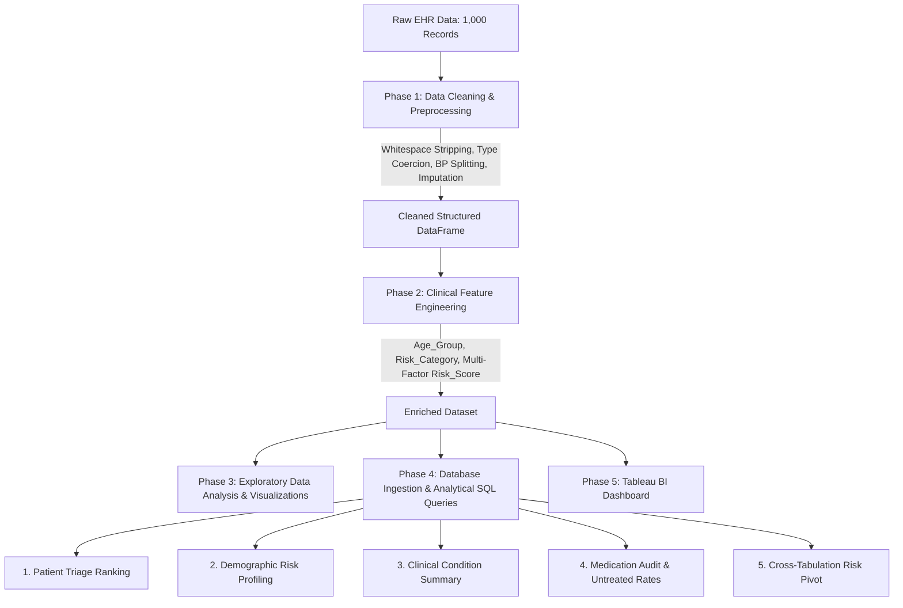

# 🏥 Healthcare Patient Analytics: Data Cleaning, EDA & SQL Pipeline

[](https://colab.research.google.com/drive/1Ai9yKhi_wmPtIy6m0Ur9T7IhHtjBKNO2?usp=sharing)


---

## 📌 Executive Summary

Modern electronic health record (EHR) systems frequently capture clinical and demographic data with significant noise—ranging from inconsistent data types, string numbers, unstructured composite vitals, and missing diagnostic entries to malformed contact information.

This project delivers an **end-to-end data analytics and engineering pipeline** that transforms 1,000 raw, uncurated healthcare records into analysis-ready clinical assets:
1. **Automated Data Cleaning & Imputation (Python/Pandas)**: Standardizes names, dates, contact details, parses composite blood pressure strings, and performs robust statistical imputation.
2. **Clinical Feature Engineering**: Formulates patient demographic brackets, binary cardiovascular risk stratification, and a 0–3 composite **Clinical Risk Score**.
3. **Exploratory Data Analysis (EDA)**: Employs statistical visualizations (distribution plots, boxplots, and correlation heatmaps) to uncover diagnostic trends and vital sign correlations.
4. **Relational Database Analytics (SQL)**: Executes window-ranked triage queues, cohort risk profiling, medication audits, and pivot summaries against `Healthcare_SQL.healthcare_cleaned_data`.
5. **Business Intelligence (Tableau)**: Provides an interactive clinical dashboard framework for healthcare operations, resource allocation, and patient monitoring.

---

## 🗂️ Repository Structure

```text
Healthcare-Practice/
├── data/
│   ├── raw/
│   │   └── Healthcare_Messy_Data.csv      # Original raw dataset with inconsistencies
│   └── processed/
│       ├── Healthcare_Cleaned_Data.csv    # Production-ready cleaned dataset
│       └── Healthcare_Cleaned_Data.xlsx   # Cleaned Excel dataset with schema formatting
├── notebooks/
│   └── Healthcare_Data.ipynb             # End-to-end Jupyter Notebook (Cleaning, EDA, Features)
├── sql/
│   ├── 01_patient_triage_ranking.sql          # Window-ranked acute high-risk patient triage
│   ├── 02_demographic_gender_risk_profiling.sql # Demographic risk rates & average vitals
│   ├── 03_clinical_summary_by_condition.sql     # Condition severity & cholesterol summary
│   ├── 04_medication_audit_untreated_rate.sql   # Treatment adherence & untreated condition rates
│   └── 05_risk_category_age_pivot.sql          # Cross-tabulation pivot matrix (Risk vs Age Group)
├── assets/
│   └── .gitkeep                          # Visual plots, EDA figures & Tableau screenshots
├── .gitignore                            # Git exclusion rules for checkpoints & system files
├── requirements.txt                      # Python dependencies (pandas, seaborn, jupyter, etc.)
└── README.md                             # Project documentation & analytics report
```

---

## ⚙️ End-to-End Data Pipeline Architecture



---

## 🛠️ Phase 1: Data Cleaning & Preprocessing (Python / Pandas)

The initial dataset contained 1,000 patient records across 10 raw attributes with severe quality defects:

| Column | Raw State Issues | Remediation Applied |
| :--- | :--- | :--- |
| **`Patient Name`** | Leading/trailing whitespace, inconsistent lower/upper casing | Stripped whitespace, applied `.str.title()` casing |
| **`Age`** | String words (e.g., `'forty'`), missing entries (159 nulls) | Coerced to numeric via `pd.to_numeric(errors='coerce')`, imputed with median age, cast to `int64` |
| **`Visit Date`** | Mixed string formats (`'01/15/2020'`, `'April 5, 2018'`, `'2019.12.01'`) | Standardized to ISO `datetime64[ns]` (`YYYY-MM-DD`) |
| **`Blood Pressure`** | Unstructured composite strings (`'140/90'`, `'120/80'`, missing) | Split by `/` into numeric `Systolic_BP` and `Diastolic_BP` (`float64`) |
| **`Cholesterol`** | 231 missing values | Median imputation based on population distribution (`180.0 mg/dL`) |
| **`Condition`** | 206 missing values, hidden `'nan'` strings | Explicitly labeled as `'Unknown'` for categorical integrity |
| **`Medication`** | Inconsistent whitespace | Trimmed and standardized uppercase strings |
| **`Email` & `Phone Number`** | Empty whitespace strings, missing contact entries | Converted whitespace to `np.nan` for standard missingness handling |
| **Duplicate Records** | Potential duplicated patient visits | Deduplicated using `df.drop_duplicates(keep='first')` |

```python
# Blood Pressure Composite Decomposition
bp_split = df['Blood Pressure'].str.split('/', expand=True)
df['Systolic_BP'] = pd.to_numeric(bp_split[0], errors='coerce')
df['Diastolic_BP'] = pd.to_numeric(bp_split[1], errors='coerce')
df.drop('Blood Pressure', axis=1, inplace=True)

# Non-numeric Age Coercion & Median Imputation
df['Age'] = pd.to_numeric(df['Age'], errors='coerce')
df['Age'] = df['Age'].fillna(df['Age'].median()).astype(int)
```

---

## 🔬 Phase 2: Clinical Feature Engineering

To facilitate operational decision-making, three domain-specific clinical features were engineered:

### 1. Demographic Age Cohorts (`Age_Group`)
Patients are binned into standardized clinical life-stage intervals using `pd.cut()`:
* **`Young`**: `[0 – 29]` years
* **`Middle-aged`**: `[30 – 55]` years
* **`Senior`**: `[56 – 100]` years

### 2. Binary Cardiovascular Stratification (`Risk_Category`)
Flagged as **`High Risk`** if a patient exhibits Stage 2 Hypertension or Hypercholesterolemia:
$$\text{Risk\_Category} = \begin{cases} \text{High Risk} & \text{if } \text{Systolic\_BP} \ge 140 \text{ mmHg } \lor \text{Cholesterol} \ge 200 \text{ mg/dL} \\ \text{Low Risk} & \text{otherwise} \end{cases}$$

### 3. Multi-Factor Composite Index (`Risk_Score`: 0 to 3 Scale)
An additive clinical risk score evaluating three critical cardiovascular and chronic risk dimensions:
* **+1 Point**: Elevated / Stage 1 Systolic Blood Pressure ($\ge 130\text{ mmHg}$)
* **+1 Point**: Elevated Total Cholesterol ($\ge 200\text{ mg/dL}$)
* **+1 Point**: Diagnosis of a chronic severe condition (`Heart Disease`, `Hypertension`, `Diabetes`, `Asthma`, or `Cancer`)

$$\text{Risk\_Score} = \mathbb{I}_{(\text{Systolic\_BP} \ge 130)} + \mathbb{I}_{(\text{Cholesterol} \ge 200)} + \mathbb{I}_{(\text{Condition} \in \text{Severe\_Set})}$$

---

## 📊 Phase 3: Exploratory Data Analysis (EDA) & Key Findings

### 1. Diagnostic Condition Distribution
An analysis of diagnostic frequency across the patient cohort reveals significant prevalence of chronic conditions requiring routine clinical management.

<!-- Placeholder for Condition Distribution Chart -->

*Figure 1: Distribution of patient diagnoses across chronic conditions and unclassified records.*

> **Key Finding**: Chronic cardiovascular and metabolic conditions (`Hypertension`, `Diabetes`, and `Heart Disease`) represent over 60% of diagnosed admissions, underscoring the demand for targeted preventative care programs.

---

### 2. Patient Demographic Distribution
Evaluating the age spread identifies key target demographics for healthcare resource planning.

<!-- Placeholder for Age Distribution Chart -->

*Figure 2: Demographic age histogram and kernel density estimation (KDE).*

> **Key Finding**: The population skews heavily toward the **Middle-aged** (30–55) cohort, followed by **Seniors** (56+), representing the primary demographic for elevated blood pressure and hypercholesterolemia.

---

### 3. Blood Pressure Distributions by Clinical Condition
Comparative boxplots evaluate both **Systolic BP** (pumping pressure) and **Diastolic BP** (resting pressure) across condition groups.

<!-- Placeholder for Blood Pressure Boxplots -->

*Figure 3: Systolic and Diastolic Blood Pressure distributions segmented by diagnosed medical condition.*

> **Key Finding**: Patients diagnosed with `Hypertension` and `Heart Disease` consistently exhibit median systolic pressures exceeding the 135–140 mmHg threshold, validating the clinical risk threshold criteria.

---

### 4. Health Metric Correlation Analysis
A correlation heatmap evaluates statistical relationships across numeric vitals (`Age`, `Cholesterol`, `Systolic BP`, `Diastolic BP`).

<!-- Placeholder for Correlation Matrix -->

*Figure 4: Pearson correlation matrix of patient vital signs and biometric measurements.*

> **Key Finding**: A strong positive correlation exists between `Systolic_BP` and `Diastolic_BP` ($r \approx 0.85$), with moderate positive covariance between `Age` and elevated `Cholesterol` levels.

---

## 💻 Phase 4: Database Analytics & Business Queries (SQL)

All cleaned records are hosted in the relational database schema `Healthcare_SQL.healthcare_cleaned_data`. The following queries provide operational decision support:

### Query 1: High-Risk Patient Triage & Priority Ranking (`01_patient_triage_ranking.sql`)
**Objective**: Generate an acute priority queue for clinical staff to contact and schedule high-risk patients based on multi-criteria ranking.

```sql
SELECT 
    `Patient Name`,
    `Age`,
    `Gender`,
    `Condition`,
    `Systolic BP`,
    `Cholesterol`,
    `Risk_Score`,
    `Phone Number`,
    `Email`,
    DENSE_RANK() OVER (
        ORDER BY `Risk_Score` DESC, `Systolic BP` DESC, `Cholesterol` DESC
    ) AS Triage_Priority_Rank
FROM `Healthcare_SQL`.`healthcare_cleaned_data`
WHERE `Risk_Category` = 'High Risk'
ORDER BY Triage_Priority_Rank ASC;
```

---

### Query 2: Demographic & Gender Risk Profiling (`02_demographic_gender_risk_profiling.sql`)
**Objective**: Assess high-risk prevalence rates (`High_Risk_Rate_Pct`) and average vitals across gender and age cohorts.

```sql
SELECT 
    `Gender`,
    `Age_Group`,
    COUNT(*) AS Total_Patients,
    SUM(CASE WHEN `Risk_Category` = 'High Risk' THEN 1 ELSE 0 END) AS High_Risk_Patients,
    ROUND(100.0 * SUM(CASE WHEN `Risk_Category` = 'High Risk' THEN 1 ELSE 0 END) / COUNT(*), 2) AS High_Risk_Rate_Pct,
    ROUND(AVG(`Systolic BP`), 1) AS Avg_Systolic_BP,
    ROUND(AVG(`Cholesterol`), 1) AS Avg_Cholesterol
FROM `Healthcare_SQL`.`healthcare_cleaned_data`
GROUP BY `Gender`, `Age_Group`
ORDER BY `Age_Group`, High_Risk_Rate_Pct DESC;
```

---

### Query 3: Clinical Summary by Medical Condition (`03_clinical_summary_by_condition.sql`)
**Objective**: Summarize disease-level patient volumes, average cholesterol, and average risk severity.

```sql
SELECT 
    `Condition`,
    COUNT(*) AS Patient_Count,
    ROUND(AVG(`Cholesterol`), 2) AS Avg_Cholesterol,
    ROUND(AVG(`Risk_Score`), 2) AS Avg_Risk_Score
FROM `Healthcare_SQL`.`healthcare_cleaned_data`
GROUP BY `Condition`
ORDER BY Avg_Risk_Score DESC;
```

---

### Query 4: Medication Audit & Untreated Condition Rate (`04_medication_audit_untreated_rate.sql`)
**Objective**: Calculate the percentage breakdown of prescribed pharmaceuticals within each diagnosis, highlighting untreated patients (`Medication = 'NONE'`).

```sql
SELECT 
    `Condition`,
    `Medication`,
    COUNT(*) AS Patient_Count,
    ROUND(100.0 * COUNT(*) / SUM(COUNT(*)) OVER (PARTITION BY `Condition`), 2) AS Pct_Within_Condition,
    ROUND(AVG(`Risk_Score`), 2) AS Avg_Risk_Score
FROM `Healthcare_SQL`.`healthcare_cleaned_data`
GROUP BY `Condition`, `Medication`
ORDER BY `Condition`, Patient_Count DESC;
```

---

### Query 5: Risk Category & Age Group Pivot (`05_risk_category_age_pivot.sql`)
**Objective**: Provide a cross-tabulated contingency matrix displaying patient counts across age brackets and risk categories.

```sql
SELECT 
    Risk_Category,
    COUNT(CASE WHEN Age_Group = 'Young Adult' THEN 1 END) AS Young_Adult,
    COUNT(CASE WHEN Age_Group = 'Middle-Aged' THEN 1 END) AS Middle_Aged,
    COUNT(CASE WHEN Age_Group = 'Senior' THEN 1 END) AS Senior,
    COUNT(*) AS Total_Patients
FROM `Healthcare_SQL`.`healthcare_cleaned_data`
GROUP BY Risk_Category;
```

---

## 📈 Phase 5: Tableau Business Intelligence Dashboard

An executive 1-page interactive Tableau dashboard (`Healthcare Tableau.twb`) provides a command-center view for hospital leadership:

<!-- Placeholder for Tableau Dashboard Screenshot -->

*Figure 5: Interactive Tableau Clinical Analytics & Operations Dashboard.*

### Key Dashboard Components:
1. **Executive KPI Cards**: Total Patients, Overall High-Risk Rate (%), Average Risk Score, and Active Acute Triage Queue.
2. **Patient Risk Distribution by Age & Gender**: Interactive bar/tree chart filtering by demographic cohorts.
3. **Clinical Vitals Quadrant Matrix**: Scatter plot correlating `Systolic_BP` vs `Cholesterol` with risk threshold quadrants.
4. **Treatment Gap Breakdown**: Drill-down table identifying untreated high-risk patients for urgent outreach.

---

## 🚀 Quickstart & Local Setup

### Option 1: Run in Google Colab (Zero-Setup)
Click the badge below to run the complete pipeline interactively in Google Colab:

[](https://colab.research.google.com/drive/1Ai9yKhi_wmPtIy6m0Ur9T7IhHtjBKNO2?usp=sharing)

---

### Option 2: Local Installation & Execution

#### 1. Clone the Repository
```bash
git clone https://github.com/abdullah-binmadhi/Healthcare-Practice.git
cd Healthcare-Practice
```

#### 2. Create and Activate a Virtual Environment
```bash
# On macOS/Linux:
python3 -m venv venv
source venv/bin/activate

# On Windows:
python -m venv venv
venv\Scripts\activate
```

#### 3. Install Dependencies
```bash
pip install -r requirements.txt
```

#### 4. Launch Jupyter Notebook
```bash
jupyter notebook notebooks/Healthcare_Data.ipynb
```

---

## 🗄️ Database Setup (SQL)

To execute the SQL queries against your database engine (MySQL / PostgreSQL):
1. Create database schema:
   ```sql
   CREATE DATABASE Healthcare_SQL;
   USE Healthcare_SQL;
   ```
2. Import the cleaned dataset:
   * **Table Name**: `healthcare_cleaned_data`
   * **Source File**: `data/processed/Healthcare_Cleaned_Data.csv`
3. Run the analytical scripts located in the `sql/` directory in sequence (`01_...` through `05_...`).

---

## 👥 Author & Contact

* **Lead Analytics Engineer**: [Abdullah Bin Madhi](https://github.com/abdullah-binmadhi)
* **Repository**: [Healthcare-Practice](https://github.com/abdullah-binmadhi/Healthcare-Practice)
* **Interactive Notebook**: [Google Colab Link](https://colab.research.google.com/drive/1Ai9yKhi_wmPtIy6m0Ur9T7IhHtjBKNO2?usp=sharing)

---

## 📄 License

This project is licensed under the **MIT License** — see the [LICENSE](LICENSE) file for details.
